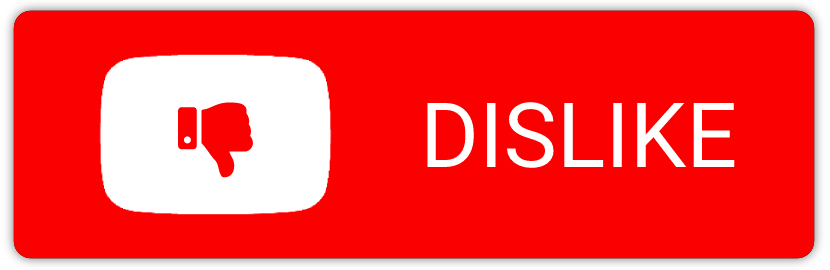

<a href='javascript: (() => {if(location.hostname.match("youtube.com")){ if(document.getElementById("avatar-btn")){var comsec = document.getElementById("comments"); if(comsec){comsec.scrollIntoView();} else {window.alert("Can not find comments. Please scroll to comment section first.");} const videoID = new URLSearchParams(window.location.search).get("v"); if(videoID == null){window.alert("It seems this is not a YouTube video page.");} else {setTimeout(function(){var dislike = document.querySelector("button[aria-label=\"Dislike this video\"]"); if(dislike.getAttribute("aria-pressed") == "false") {dislike.click();} document.getElementById("simplebox-placeholder").click(); document.getElementById("contenteditable-root").innerHTML = "DISLIKE "; var submit = document.getElementById("submit-button"); submit.scrollIntoView(); window.scrollBy(0, -120); submit.removeAttribute("disabled"); submit.click();}, 2000);}} else {window.alert("You need to be signed in to comment.");}} else {window.alert("This is not YouTube.com.");}})();'></a>

# Youtube Dislike Button

YouTube is making the dislike count private [[1](https://blog.youtube/news-and-events/update-to-youtube/)]. Quite a lot of people on the Internet did not like this change. Instead, they plan to comment 'dislike' to publicly show they do not like the content. This button just makes it easier.

* Drag and drop this button <a href='javascript: (() => {if(location.hostname.match("youtube.com")){ if(document.getElementById("avatar-btn")){var comsec = document.getElementById("comments"); if(comsec){comsec.scrollIntoView();} else {window.alert("Can not find comments. Please scroll to comment section first.");} const videoID = new URLSearchParams(window.location.search).get("v"); if(videoID == null){window.alert("It seems this is not a YouTube video page.");} else {setTimeout(function(){var dislike = document.querySelector("button[aria-label=\"Dislike this video\"]"); if(dislike.getAttribute("aria-pressed") == "false") {dislike.click();} document.getElementById("simplebox-placeholder").click(); document.getElementById("contenteditable-root").innerHTML = "DISLIKE "; var submit = document.getElementById("submit-button"); submit.scrollIntoView(); window.scrollBy(0, -120); submit.removeAttribute("disabled"); submit.click();}, 2000);}} else {window.alert("You need to be signed in to comment.");}} else {window.alert("This is not YouTube.com.");}})();'></a> into your browser bookmarks.
* Visit a video on youtube and hit the button if you did not like it.
* It will automatically add a comment "DISLIKE" into the video's comment section.
* It also clicks on the official YouTube dislike button.
* To revert, just delete the comment yourself and click thumbs up as usual.
* To "uninstall", just remove the bookmark.

This should work on most of the desktop browsers, no guarantees though. The code is simple and self-explanatory, basically it only finds the comment section, types in the comment, and hits the submit button. It is so simple, that in case it does not work, at least it won't break anything.

Feel free to create an issue if you find some problem. I will feel free to decide whether I do something about it :) In the end, this is a two-hour weekend project for fun.
