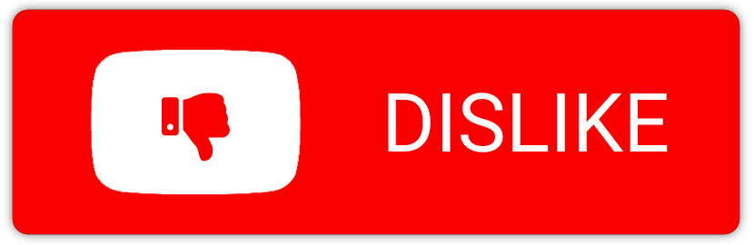

# Youtube Dislike Button

YouTube is making the dislike count private [[1](https://blog.youtube/news-and-events/update-to-youtube/)]. Quite a lot of people on the Internet did not like this change. Instead, they plan to comment 'dislike' to publicly show they do not like the content. This button just makes it easier. Go to <a href="https://paloha.github.io/youtube-dislike-button/" target="_blank">https://paloha.github.io/youtube-dislike-button/</a> to start using it.

Feel free to create an issue if you find some problem. I will feel free to decide whether I do something about it :smiley: In the end, this is a two-hour weekend project for fun.

Acknowledgement: Thanks YouTube Rewind 2018 for being a "dislike testing dummy".
